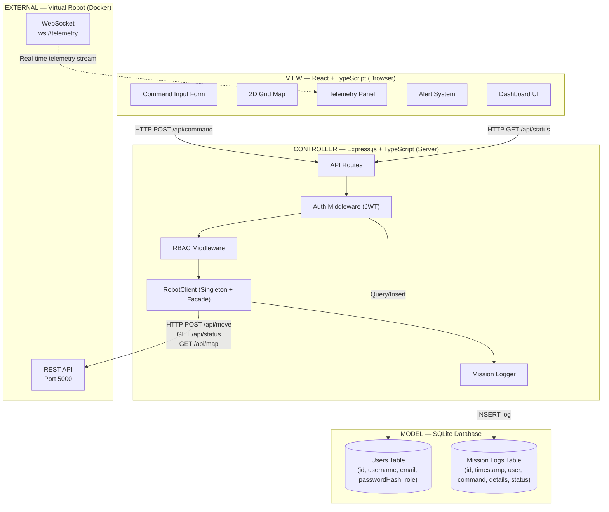
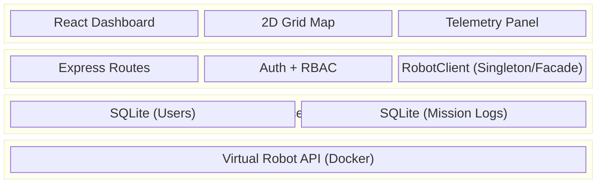

# Architecture — Robot Management System

## Chosen Architectural Pattern: Model-View-Controller (MVC)

The Robot Management System follows the **Model-View-Controller (MVC)** architectural pattern, a well-established approach for web applications that enforces a clear separation of concerns between data management, user interface rendering, and request handling logic. This pattern was chosen because the system requires distinct responsibilities: a React frontend that displays real-time robot telemetry and a 2D grid map (View), an Express.js backend that processes HTTP requests, enforces RBAC, and communicates with the Virtual Robot API (Controller), and a SQLite database layer that persists user accounts and mission audit logs (Model).

By decoupling these three layers, each can be developed, tested, and modified independently. For example, the React frontend can be redesigned without altering the backend business logic, and the database layer could be swapped from SQLite to PostgreSQL without impacting the API routes or the UI. This modularity directly supports the assessment's requirement for scalable, maintainable code built with professional engineering practices.

## Tech Stack

| Layer | Technology | Role |
|---|---|---|
| **View** | React + TypeScript + Vite | Renders the dashboard UI: 2D grid map, telemetry panel, alerts, command inputs. Communicates with backend via HTTP and WebSocket. |
| **Controller** | Express.js + TypeScript | Processes HTTP requests, enforces authentication (JWT) and RBAC, routes commands to the Robot API, handles retry logic. |
| **Model** | SQLite + TypeORM/better-sqlite3 | Persists user accounts (registration, roles, hashed passwords) and mission audit logs (timestamp, user, command, response). |
| **External Service** | Virtual Robot Docker Container | Provides REST API (port 5000) and WebSocket telemetry. Not part of our codebase — integrated via HTTP client. |

## MVC Mapping Diagram

## Layered View

The MVC components also map to a traditional **Layered Architecture**:

## Design Patterns Applied

| Pattern | Category | Where Applied | Purpose |
|---|---|---|---|
| **Singleton** | Creational | RobotClient | Ensures only one instance manages the HTTP connection to the Robot API across the entire backend |
| **Facade** | Structural | RobotClient | Hides raw HTTP calls, JSON parsing, headers, and retry logic behind clean methods: `getStatus()`, `move(x, y)`, `reset()` |
| **Observer** | Behavioural | WebSocket telemetry → React state | Robot status changes automatically propagate to all subscribed UI components (grid, telemetry panel, alerts) |
| **MVC** | Architectural | Entire system | Separates View (React), Controller (Express), and Model (SQLite) for modularity and testability |
