# CMP9134 - Robot Management System

Web-based Ground Control Station for monitoring and controlling a virtual autonomous robot.

CMP9134 Software Engineering Assessment - University of Lincoln

## Features
- Real-time robot telemetry monitoring
- 2D grid map interface with obstacle visualisation
- Role-Based Access Control (Viewer / Commander / Auditor)
- Mission command logging (audit trail)
- Connection error handling with retry logic
- Emergency stop functionality

## System Architecture

```mermaid
flowchart TB
    subgraph User["👤 Users"]
        Commander["🎖️ Commander"]
        Viewer["👁️ Viewer"]
        Auditor["📋 Auditor"]
    end

    subgraph GCS["Ground Control Station (docker-compose)"]
        subgraph Frontend["Web Dashboard (Browser)"]
            UI["React / HTML UI"]
            GridMap["2D Grid Renderer"]
            Alerts["Alert System"]
            TelemetryPanel["Telemetry Panel"]
        end

        subgraph Backend["Backend API (Docker Container)"]
            AuthService["AuthService\n(JWT + Bcrypt)"]
            RobotController["RobotController\n(API Client + Retry Logic)"]
            RBAC["RBAC Middleware"]
            Logger["Mission Logger"]
        end

        subgraph DataLayer["Database (Docker Container)"]
            UserDB[("Users Table")]
            LogDB[("Mission Logs Table")]
        end
    end

    subgraph RobotSim["Virtual Robot (Docker Container)\nPort 5000"]
        RestAPI["REST API\n/api/status\n/api/move\n/api/map\n/api/sensor\n/api/reset"]
        WebSocketAPI["WebSocket\nws://telemetry"]
    end

    %% User connections
    Commander --> UI
    Viewer --> UI
    Auditor --> UI

    %% Frontend to Backend
    UI -->|"HTTP Requests"| RBAC
    UI -->|"WebSocket"| TelemetryPanel

    %% Backend internal
    RBAC --> AuthService
    RBAC --> RobotController
    RobotController --> Logger
    AuthService --> UserDB
    Logger --> LogDB

    %% Backend to Robot
    RobotController -->|"HTTP\nPOST /api/move\nGET /api/status\nGET /api/map"| RestAPI
    TelemetryPanel -->|"ws://localhost:5000/ws/telemetry"| WebSocketAPI

    %% Styling
    style GCS fill:#1a1a2e,stroke:#16213e,color:#fff
    style Frontend fill:#0f3460,stroke:#533483,color:#fff
    style Backend fill:#533483,stroke:#e94560,color:#fff
    style DataLayer fill:#16213e,stroke:#0f3460,color:#fff
    style RobotSim fill:#e94560,stroke:#fff,color:#fff
```



## Architecture Overview

| Component | Technology | Responsibility |
|---|---|---|
| **Web Dashboard** | HTML/CSS/JS (or React) | User interface — grid map, telemetry panel, alerts, command inputs |
| **Backend API** | Python (FastAPI) or Node.js | Authentication, RBAC, robot API communication, retry logic, mission logging |
| **Database** | SQLite / PostgreSQL | Stores user accounts and mission audit logs |
| **Virtual Robot** | Docker container (provided) | Simulates robot with REST API and WebSocket telemetry on port 5000 |

## Deployment

All components run via `docker-compose`:

```bash
docker-compose up
```

This starts the Ground Control Station (backend + frontend + database) alongside the Virtual Robot simulation container.

## Documentation

- [Use Case Diagram](docs/use-case-diagram.md) — Actor-permission mapping (RBAC)
- [Activity Diagram](docs/activity-diagram.md) — Move command business logic flow
- [Class Diagram](docs/class-diagram.md) — OOP backend architecture
- [Sequence Diagram](docs/sequence-diagram.md) — Move command interaction timeline
- [Privacy Policy](PRIVACY_POLICY.md) — GDPR compliance documentation
- [AI Verification Log](AI_VERIFICATION_LOG.md) — AI usage tracking
