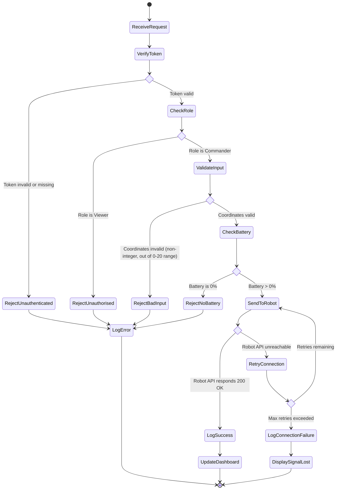

# Activity Diagram — Move Robot Command

This diagram models the **behavioural perspective**: the complete business logic the backend executes when a user attempts to send a move command, including RBAC checks, input validation, API communication, and error handling.

## Diagram

## Flow Summary
1. **Receive Request** — User clicks "Move" on the dashboard.
2. **Verify Token** — Check if the user is authenticated. Reject if token is invalid.
3. **Check Role** — Enforce RBAC. Only Commanders can send commands; Viewers are rejected.
4. **Validate Input** — Ensure coordinates are integers within 0-20 range.
5. **Check Battery** — Prevent movement if battery is at 0%.
6. **Send to Robot** — POST /api/move to the Virtual Robot API.
7. **API Response Check** — If robot responds 200 OK, log success and update dashboard. If unreachable, retry with backoff.
8. **Retry Logic** — If max retries exceeded, log connection failure and display "Signal Lost".

## Notes
- Every rejection and failure path routes through logging (LogError) — satisfying the audit trail requirement.
- Retry logic handles the simulated network latency and random dropouts specified in the assessment brief.
- This diagram directly informs the backend implementation architecture.
