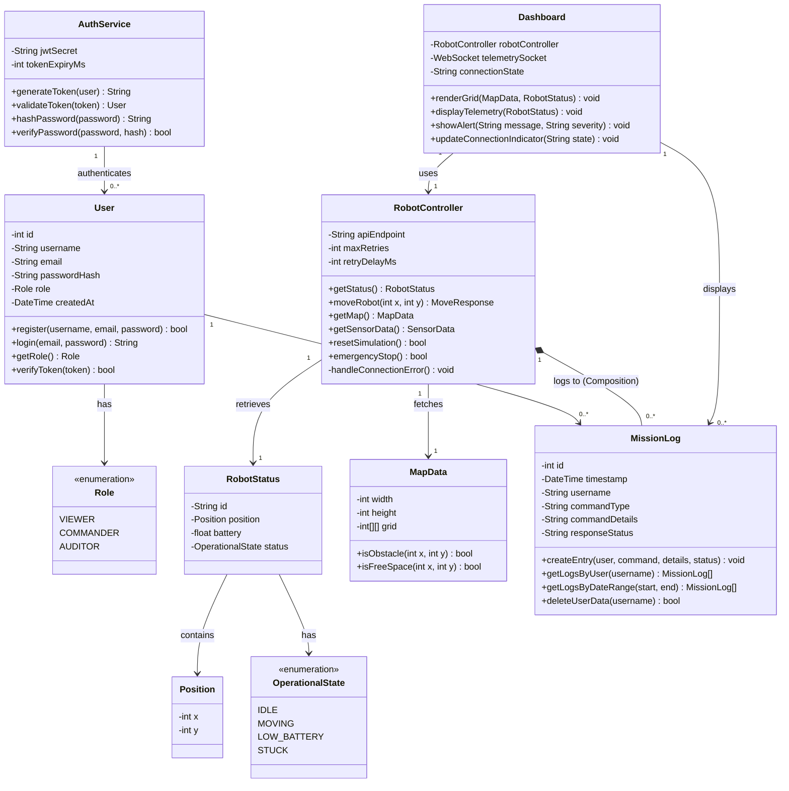

# Class Diagram — Robot Management System

This diagram models the **structural perspective**: the Object-Oriented architecture of the backend, showing classes, attributes, operations, and their relationships.

## Diagram

## Class Responsibilities

| Class | Responsibility |
|---|---|
| **User** | Manages user registration, login, and role assignment |
| **Role** | Enum defining VIEWER, COMMANDER, AUDITOR permissions |
| **AuthService** | Handles JWT token generation, validation, and password hashing (Bcrypt) |
| **RobotController** | Single point of contact with the Virtual Robot API — encapsulates all HTTP calls and retry logic |
| **RobotStatus** | Data model representing the robot's current state from GET /api/status |
| **Position** | Value object for x, y coordinates on the 21x21 grid |
| **OperationalState** | Enum for robot states: IDLE, MOVING, LOW_BATTERY, STUCK |
| **MapData** | Represents the 21x21 grid with obstacle detection methods |
| **MissionLog** | Audit trail entity — logs every command with timestamp, user, type, and response. Supports GDPR deletion. |
| **Dashboard** | Frontend controller — renders the grid, telemetry, alerts, and connection state |

## Design Decisions
- **Composition** between RobotController and MissionLog — logs cannot exist without the controller context. Every API interaction is logged.
- **MissionLog.deleteUserData()** — satisfies GDPR "Right to Erasure" requirement.
- **AuthService** is separated from User — Single Responsibility Principle. Authentication logic is not mixed with user data.
- **RobotController** encapsulates retry logic internally (handleConnectionError) — keeps error handling out of the Dashboard layer.
