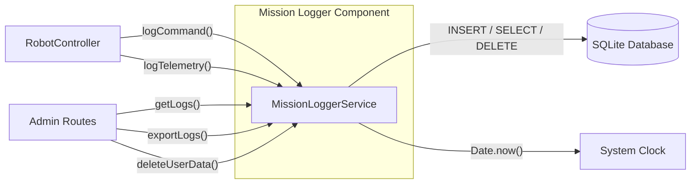

# Mission Logger — CBSE Interface Specification

The Mission Logger is treated as an independent **Component-Based Software Engineering (CBSE)** component. It is specified entirely by its interfaces so it can be developed, tested, and replaced independently of the rest of the backend.

## Component Diagram



## Provides Interface

These are the services the Mission Logger **exposes** to the rest of the backend.

| Method | Signature | Description |
|---|---|---|
| `logCommand` | `logCommand(userId: string, action: string, details: object): Promise<void>` | Records a user-issued command (move, reset, e-stop) with timestamp and payload |
| `logTelemetry` | `logTelemetry(status: RobotStatus): Promise<void>` | Snapshots robot telemetry (battery, position, state) at a point in time |
| `getLogs` | `getLogs(filters?: LogFilter): Promise<MissionLog[]>` | Queries stored logs with optional filters (date range, user, command type) |
| `exportLogs` | `exportLogs(format: "json" \| "csv"): Promise<string>` | Serialises the full audit trail for download or compliance reporting |
| `deleteUserData` | `deleteUserData(userId: string): Promise<number>` | GDPR right-to-erasure — removes all logs tied to a specific user, returns count of deleted rows |

## Requires Interface

These are the external services the Mission Logger **depends on** to function.

| Dependency | Interface Required | Purpose |
|---|---|---|
| **SQLite Database** | `INSERT`, `SELECT`, `DELETE` operations on `mission_logs` table | Persistent storage for all log entries |
| **System Clock** | `Date.now()` or equivalent timestamp provider | Generates accurate timestamps for each log entry |

## Data Contract

Each log entry persisted to the `mission_logs` table has the following shape:

```typescript
interface MissionLog {
  id: number;            // auto-increment primary key
  timestamp: string;     // ISO 8601 (e.g. "2026-03-05T14:30:00Z")
  userId: string;        // FK to users table
  username: string;      // denormalised for quick display
  action: string;        // "MOVE" | "RESET" | "STATUS_CHECK" | "TELEMETRY"
  details: string;       // JSON-stringified payload (coordinates, battery, etc.)
  status: string;        // outcome: "SUCCESS" | "FAILED" | "TIMEOUT"
}
```

## Design Rationale

- **Decoupled from RobotClient**: The logger receives data passed to it — it never calls the Robot API itself. This keeps the component focused on persistence and auditing.
- **Dependency Injection**: The database connection and clock are injected via the constructor, making the component easily testable with mocks.
- **GDPR by Design**: `deleteUserData()` is a first-class method, not an afterthought, directly supporting the project's PRIVACY_POLICY.md commitments.
