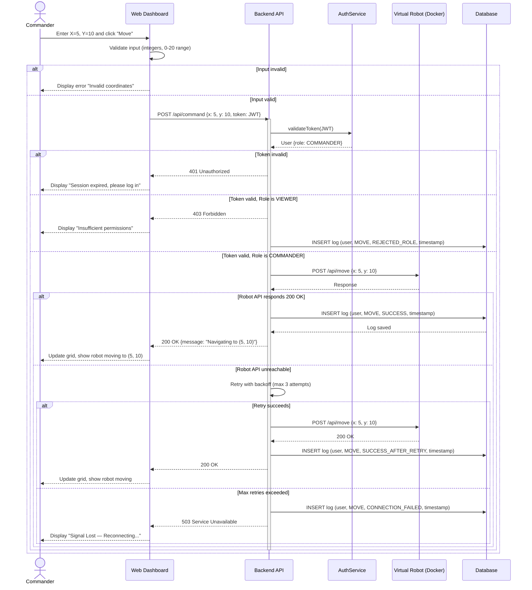

# Sequence Diagram — Move Robot Command

This diagram models the **interaction perspective**: tracing a "Move" command chronologically from the Commander through every system component, including token verification, API communication, database logging, and error handling.

## Diagram

## Interaction Flow

1. **Commander** enters coordinates and clicks "Move" on the dashboard.
2. **Web Dashboard** validates input client-side (integers, within 0-20 range). Rejects immediately if invalid.
3. **Backend API** receives the request with a JWT token.
4. **AuthService** validates the token. Rejects if expired or invalid.
5. **RBAC check** — verifies the user has COMMANDER role. Viewers are rejected with 403.
6. **Virtual Robot API** receives the POST /api/move command.
7. **Success path** — Robot responds 200 OK → log to DB → update dashboard.
8. **Failure path** — Robot unreachable → retry with backoff → if max retries exceeded → log failure → display "Signal Lost".

## Notes
- **Every path logs to the Database** — success, rejection, and failure are all audited.
- **Client-side AND server-side validation** — defence in depth.
- **Alt blocks** model conditional branching as per UML sequence diagram standards.
- This diagram directly maps to the Activity Diagram flow, providing the interaction-level detail.
