# Use Case Diagram — Robot Management System

This diagram maps the **external perspective**: who uses the Ground Control Station and what actions they are permitted to perform, based on Role-Based Access Control (RBAC).

## Actors
- **Commander**: Full access — can monitor and control the robot.
- **Viewer**: Read-only access — can view status and telemetry but cannot issue commands.
- **Auditor**: Can access mission logs for safety accountability and compliance.

## Diagram

```mermaid
flowchart LR
    %% Define Actors
    C[🎖️ Commander]
    V[👁️ Viewer]
    A[📋 Auditor]

    %% Define System Boundary
    subgraph GCS [Ground Control Station]
        Login((Login / Register))
        Move((Move Robot))
        Status((View Robot Status))
        Telemetry((View Telemetry))
        Map((View 2D Grid Map))
        Alerts((View Critical Alerts))
        Reset((Reset Simulation))
        Logs((View Audit Logs))
        EStop((Emergency Stop))
    end

    %% Commander: Full access
    C --> Login
    C --> Move
    C --> Status
    C --> Telemetry
    C --> Map
    C --> Alerts
    C --> Reset
    C --> EStop

    %% Viewer: Read-only access
    V --> Login
    V --> Status
    V --> Telemetry
    V --> Map
    V --> Alerts

    %% Auditor: Log access
    A --> Login
    A --> Logs

    %% External System
    Robot[🤖 Virtual Robot API]
    Move -.-> Robot
    Reset -.-> Robot
    Status -.-> Robot
    Telemetry -.-> Robot
    EStop -.-> Robot
```

## Notes
- Dashed lines (-.->)  indicate interactions with the external Virtual Robot API (Docker container).
- The system boundary (subgraph) defines the scope of our application.
- Viewer has NO connection to Move, Reset, or Emergency Stop — enforcing RBAC visually.
- Auditor has access only to Login and Audit Logs — principle of least privilege.
